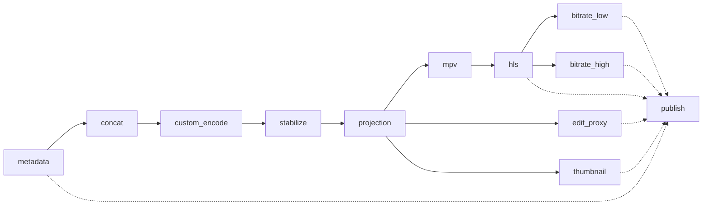
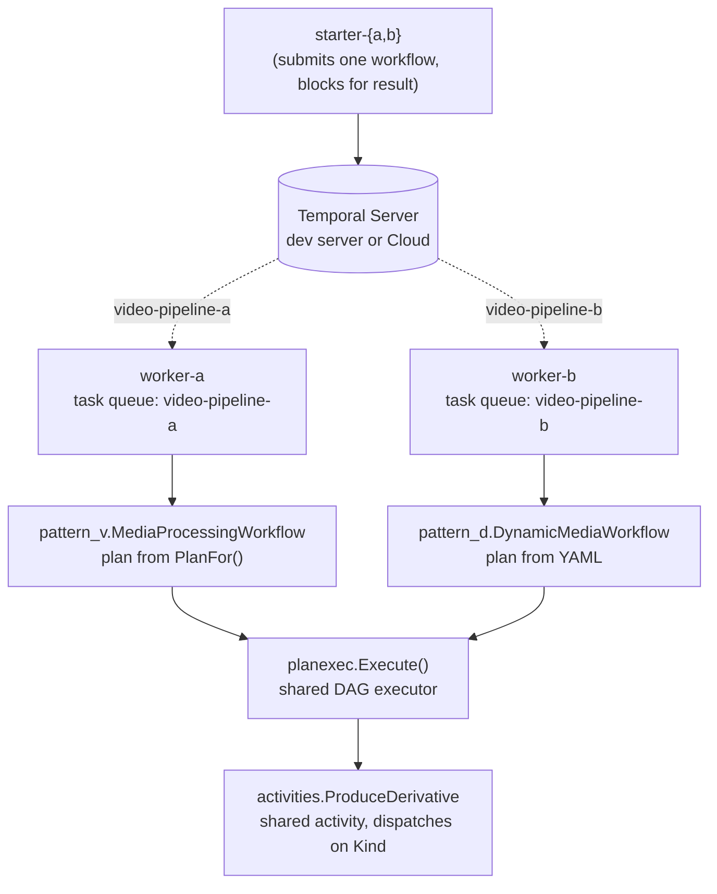

# video-pipeline-demo

A working Temporal Go SDK demo of a branching, DAG-shaped video pipeline expressed durably and observably. Two patterns sharing one activity layer and one DAG executor:

- **Pattern V** — plan-in-code (versioned Go workflow).
- **Pattern D** — plan-in-YAML (no code change to add a media type).

Each pattern has its own narrated rehearsal script (`./demo-a.sh` / `./demo-b.sh`) that drives the demo end-to-end against a local Temporal dev server.

## Contents

- [What you'll see](#what-youll-see)
- [Pipeline shape](#pipeline-shape)
- [Architecture](#architecture)
- [Pattern V vs Pattern D](#pattern-v-vs-pattern-d)
- [Setup](#setup)
- [Running the demos (dev)](#running-the-demos-dev)
- [Running the demos (Temporal Cloud)](#running-the-demos-temporal-cloud)
- [Tests](#tests)
- [Adding a new media type](#adding-a-new-media-type)
- [Repository layout](#repository-layout)
- [Temporal concepts demonstrated](#temporal-concepts-demonstrated)
- [Acknowledgements](#acknowledgements)

## What you'll see

### Demo A — Pattern V (`./demo-a.sh`)

| # | Moment | What it demonstrates |
|---|---|---|
| 1/7 | iPhone short clip | 4-step linear pipeline; baseline observability |
| 2/7 | Spherical 360° | 12-step DAG; parallelism after `projection`; same workflow code as the 4-step |
| 3/7 | Kill the worker mid-pipeline | [Durable execution](https://docs.temporal.io/evaluate/understanding-temporal#durable-execution) — `kill -TERM` the worker process, a fresh worker resumes from the task queue with no work repeated |
| 4/7 | `temporal workflow cancel` | Graceful [cancellation](https://docs.temporal.io/develop/go/workflows/cancellation) — in-flight activity `ctx.Done()` fires; a `workflow.NewDisconnectedContext` cleanup activity writes a manifest *after* the main ctx is canceled |
| 5/7 | Misconfigured media | Bounded failure — 5-attempt [retry policy](https://docs.temporal.io/encyclopedia/retry-policies) caps at ≈15 s of backoff, then surfaces a clean workflow failure. No infinite loop. |
| 6/7 | Replay test catches a non-determinism bug | [Replay testing](https://docs.temporal.io/develop/go/best-practices/testing-suite#replay) — toggle a line in `workflow.go`, replay against captured history, fail loudly |
| 7/7 | UI walkthrough | Search by `MediaID` [custom search attribute](https://docs.temporal.io/develop/go/platform/observability#custom-search-attributes); inspect any workflow's timeline |

### Demo B — Pattern D (`./demo-b.sh`)

| # | Moment | What it demonstrates |
|---|---|---|
| 1/5 | Short clip from YAML | 4-step plan parsed from `dsl/short_clip.yaml` — no Go change |
| 2/5 | Spherical from YAML | 12-step plan parsed from `dsl/spherical_chaptered.yaml` — same workflow code |
| 3/5 | Signal a running workflow | [Signals](https://docs.temporal.io/develop/go/workflows/message-passing#signals) — `temporal workflow signal --name add_derivative` queues a bonus step; the workflow drains it after the main plan and runs an extra activity, all in one history |
| 4/5 | Add a step via YAML edit | Runtime config change — different `--plan-file`, no code change, no worker restart |
| 5/5 | Cycle rejected at submit | Pre-flight validation — cyclic YAML never starts a workflow |

Both scripts accept `--step` to pause before each moment for live narration. Without `--step` they run non-stop in ~1–2 minutes each.

## Pipeline shape

The 12-step spherical pipeline (`internal/workflows/pattern_v/plan.go` for Pattern V, `dsl/spherical_chaptered.yaml` for Pattern D). After `projection` three branches fan out; after `hls` two more. `publish` waits on six upstream artifacts.



The same workflow code drives the 4-step `short_clip` and the 12-step `spherical_chaptered` shapes. Adding a 5th, 6th, or 20-step plan is purely a plan change, not a workflow change.

## Architecture



The only thing that differs between the two patterns is where the plan comes from. The executor, activity, types, and search-attribute layers are reused verbatim.

## Pattern V vs Pattern D

|                       | Pattern V                                  | Pattern D                                              |
| --------------------- | ------------------------------------------ | ------------------------------------------------------ |
| Plan source           | Go function `PlanFor(MediaType)`           | YAML file in `dsl/`                                    |
| Adding a media type   | Edit `plan.go`, code review, ship a worker | Drop a new `<name>.yaml`, pass it to `starter-b`       |
| Validation            | Compile-time + `planexec.validate()`       | YAML parse + cycle check at submit time                |
| Versioning            | Go module SHA / worker version             | YAML file (config commit)                              |
| Runtime mutability    | Cancellation + cleanup (Demo A `[4/7]`)    | Cancellation **and** add-step-via-signal (Demo B `[3/5]`) |
| When to use           | Small set of well-known plan shapes        | Many media types, frequent additions                   |

## Setup

```bash
make setup
```

`make setup` runs `scripts/install-prereqs.sh` (installs `ffmpeg` and the [Temporal CLI](https://docs.temporal.io/cli) via Homebrew on macOS; verifies presence on Linux), downloads Go modules, starts the local Temporal dev server, registers the three custom search attributes, generates a synthetic sample clip, and pre-compiles all four binaries.

Prerequisites you provide:
- macOS or Linux (macOS is primary; Linux is best-effort).
- Go 1.22+.
- Homebrew on macOS.

Temporal Web UI: <http://localhost:8233>. Stop everything: `make teardown`.

## Running the demos (dev)

```bash
./demo-a.sh          # Pattern V — ~2 min, non-stop
./demo-b.sh          # Pattern D — ~1 min, non-stop

./demo-a.sh --step   # Pause before each moment (and key sub-moments) for live narration
./demo-b.sh --step
```

Both scripts will:

- Start the dev server if it isn't already up.
- Register search attributes (idempotent).
- Generate a synthetic sample if `samples/sample.mp4` is missing.
- Spin up the corresponding worker; tear it down on exit.
- **Leave the dev server running** so you can verify in the UI afterward.

`--step` mode prints a prompt before each narrated moment. Press **Enter** to advance. Use this when presenting live so you control pacing.

## Running the demos (Temporal Cloud)

1. Copy `.env.cloud.example` → `.env.cloud`, fill in `TEMPORAL_ADDRESS`, `TEMPORAL_NAMESPACE`, `TEMPORAL_API_KEY` (an [API key](https://docs.temporal.io/cloud/api-keys)).
2. Install [`tcld`](https://docs.temporal.io/cloud/tcld) — the registration script calls it to register the three search attributes against your Cloud namespace.
3. Run:
   ```bash
   ./demo-a-cloud.sh
   ./demo-b-cloud.sh
   ```

The cloud launchers refuse any namespace whose name contains `prod`, `production`, `prd`, `live`, or `staging` as a safety guard.

## Tests

```bash
make test                # unit + replay tests
make capture-histories   # produce testdata/histories/*.json
make test-integration    # a small number of workflows against the dev server
make lint                # gofmt -l . + go vet
```

Replay tests (`internal/workflows/pattern_{v,d}/replay_test.go`) skip cleanly if the corresponding captured history is missing. Run `make capture-histories` once after a fresh clone to produce them.

## Adding a new media type

- **Pattern V:** add a constant in `internal/types/types.go`, add a case in `internal/workflows/pattern_v/plan.go::PlanFor`, write a test, ship a new worker.
- **Pattern D:** drop a new `<name>.yaml` into `dsl/`, pass `--plan-file dsl/<name>.yaml` to `starter-b`. No code change, no worker restart.

## Repository layout

```
cmd/worker-{a,b}                  registers activities, runs forever
cmd/starter-{a,b}                 submits one workflow, blocks for result
internal/types                    shared structs and DerivativeKind constants
internal/searchattrs              typed search attribute keys + upsert
internal/tclient                  dev/cloud-aware client builder
internal/planexec                 DAG executor (shared by both patterns)
internal/activities               ProduceDerivative + MarkCancelled + helpers
internal/workflows/pattern_v      plan-in-code workflow
internal/workflows/pattern_d      plan-in-YAML workflow + DSL parser
dsl                               YAML plans consumed by Pattern D
samples                           input video (synthetic .mp4 is gitignored)
scripts                           lifecycle + rehearsal helpers
testdata/histories                captured histories used by replay tests
testdata/fixtures                 tiny clips for activity unit tests
```

Per-demo spec docs: `DEMO_A.md`, `DEMO_B.md`. Upstream-reference inspection notes: `INSPECTION.md`.

## Temporal concepts demonstrated

| Concept | Where in this repo | Docs |
|---|---|---|
| Durable execution | Worker kill at Demo A `[3/7]`; workflow state lives in Temporal, not in the worker | [Understanding Temporal](https://docs.temporal.io/evaluate/understanding-temporal#durable-execution) |
| Workflow definition (Go) | `internal/workflows/{pattern_v,pattern_d}/workflow.go` | [Workflow basics (Go)](https://docs.temporal.io/develop/go/workflows/basics) |
| Activity definition (Go) | `internal/activities/produce.go`, `cleanup.go` | [Activity basics (Go)](https://docs.temporal.io/develop/go/activities/basics) |
| Workers + task queues | `cmd/worker-{a,b}/main.go` | [Workers](https://docs.temporal.io/workers) |
| Activity heartbeats | `internal/activities/subroutines.go` (`sleepWithHeartbeat`, ffmpeg ticker) | [Heartbeats](https://docs.temporal.io/develop/go/failure-detection#activity-heartbeats) |
| Retry policies (bounded failure) | `internal/planexec/executor.go` (`MaximumAttempts: 5`) — see Demo A `[5/7]` | [Retry policies](https://docs.temporal.io/encyclopedia/retry-policies) |
| Custom search attributes | `internal/searchattrs/searchattrs.go` — see Demo A `[1/7]` and `[7/7]` | [Custom search attributes](https://docs.temporal.io/develop/go/platform/observability#custom-search-attributes) |
| Signals | `pattern_d/workflow.go` `GetSignalChannel` — see Demo B `[3/5]` | [Message passing — Signals](https://docs.temporal.io/develop/go/workflows/message-passing#signals) |
| Cancellation + disconnected context | `pattern_v/workflow.go` defer-on-cancel + `MarkCancelled` — see Demo A `[4/7]` | [Cancellation](https://docs.temporal.io/develop/go/workflows/cancellation) |
| Replay testing (non-determinism) | `pattern_v/replay_test.go`, `pattern_d/replay_test.go` — see Demo A `[6/7]` | [Replay testing](https://docs.temporal.io/develop/go/best-practices/testing-suite#replay) |
| Local dev server | `scripts/start-dev-server.sh` | [Temporal CLI](https://docs.temporal.io/cli) |
| Temporal Cloud (API key auth) | `internal/tclient/tclient.go`, `demo-*-cloud.sh` | [Cloud](https://docs.temporal.io/cloud) · [API keys](https://docs.temporal.io/cloud/api-keys) |

## Acknowledgements

Portions of `internal/activities/subroutines.go` (FFmpeg stderr regexes, `timeToMilliseconds`, the heartbeat-via-ticker pattern) are adapted from [`temporal-community/temporal-ffmpeg-pipeline`](https://github.com/temporal-community/temporal-ffmpeg-pipeline) (MIT). Full attribution in [`NOTICES.md`](NOTICES.md).
